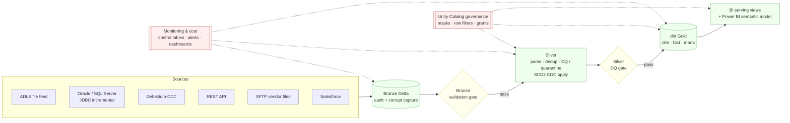

# InvestSphere Payments — Financial Services Data Platform on Azure Databricks

A governed, multi-source **lakehouse** for investment & payments data:
six Bronze sources → Silver (CDC/SCD2, DQ, quarantine) → **dbt Gold** → a **Power BI**
serving layer, with **Unity Catalog governance**, **Lakeflow Jobs** orchestration,
**monitoring/cost** observability, and **Terraform + Asset Bundles** deployment.

> Deployed on **Azure Databricks** via an Asset Bundle. **All six Bronze sources,
> the SCD2 Silver, the two validation gates, and governance validation run for real
> on Spark** (`src/payments_platform/databricks/`); the governance/monitoring/BI
> models are policy-as-code that render the deployed SQL. Cloud-agnostic data logic
> (CDC ordering, SCD2, DQ) lives in `payments_platform.*` and is imported by the Spark
> jobs, so there's one source of truth. The full design is in
> [`docs/DESIGN.md`](docs/DESIGN.md); diagrams in [`docs/ARCHITECTURE.md`](docs/ARCHITECTURE.md).

## Architecture

```
            SOURCES                     INGEST            CURATE           SERVE
  ┌──────────────────────────┐
  │ ADLS file feed (payments)│──┐
  │ Oracle / SQL Server (JDBC)│─┤
  │ Debezium CDC (customer)  │──┤   ┌─────────┐  gate  ┌──────────┐ gate ┌────────┐   ┌──────────┐
  │ REST API                 │──┼──▶│ BRONZE  │──────▶ │  SILVER  │────▶ │  GOLD  │──▶│ BI / PBI │
  │ SFTP vendor files        │──┤   │ Delta + │ valid  │ parse·   │  DQ  │ dbt:   │   │ serving  │
  │ Salesforce               │──┘   │ audit + │        │ dedup·   │      │ dim·   │   │ views +  │
  └──────────────────────────┘      │ corrupt │        │ DQ/quar· │      │ fact·  │   │ semantic │
                                    │ capture │        │ SCD2 CDC │      │ marts  │   │ model    │
                                    └─────────┘        └──────────┘      └────────┘   └──────────┘
   ───────────────────────────────────────────────────────────────────────────────────────────────
   GOVERNANCE (Unity Catalog)   PII tags · column masks · row filters · masked views · least-priv grants
   MONITORING & COST            pipeline/task/DQ/freshness/quarantine/dbt/security/cost · 9 alerts · 6 dashboards
   PLATFORM                     Terraform (infra) + Asset Bundle (jobs) + generated SQL · dev/test/prod · CI/CD
```

GitHub renders the same as a diagram:



## What's implemented

| Layer | Capability | Module / docs |
|---|---|---|
| **Bronze ingestion** | 6 active sources, all metadata-driven + For-Each, audit cols, corrupt capture | `bronze/` — file · cdc · **jdbc** · **rest** · **sftp** · **salesforce** |
| | JDBC full/incremental, watermark, backfill, retries, dup-PK | [JDBC_INGEST](docs/JDBC_INGEST.md) |
| | REST pagination/retry/incremental + raw capture; SFTP pattern/date/dup/checksum; Salesforce SystemModstamp + IsDeleted | [REST](docs/REST_INGEST.md) · [SFTP](docs/SFTP_INGEST.md) · [SALESFORCE](docs/SALESFORCE_INGEST.md) |
| **Silver** | parse/standardize, DQ severities (FAIL/QUARANTINE/WARN), Failed Record Register, dedup | `silver/` |
| | **CDC apply: SCD2 & SCD1** — hash change-detect, soft-delete, out-of-order + duplicate handling | `silver/cdc_apply.py` |
| **Gold** | dbt: `dim_customer` (+history), `fact_payments`, `daily_payment_summary` + tests | `dbt/` |
| **Governance** | PII tags, 5 groups, least-privilege grants, column masks, row filters, masked views — policy-as-code → UC SQL | `governance/` · [GOVERNANCE](docs/GOVERNANCE.md) |
| **Orchestration** | 15-task `daily_e2e` DAG: parallel Bronze → gate → Silver → DQ gate → dbt → governance → publish | `orchestration/` · [ORCHESTRATION](docs/ORCHESTRATION.md) |
| **Monitoring & cost** | 9 control/monitoring models, 9 alert rules, 6 Databricks SQL dashboards; **live gate/pipeline audit** in `silver_control` | `monitoring/` · [MONITORING](docs/MONITORING.md) · [GATE_MONITORING](docs/GATE_MONITORING.md) |
| **Performance/scale** | synthetic data, stage benchmarks, cost estimation, table-health, 8 optimization recs | `perf/` · [PERFORMANCE_COST](docs/PERFORMANCE_COST.md) |
| **BI** | 3 analyst-safe serving views + semantic model (measures/dimensions/RLS) for Power BI | `bi/` · [POWER_BI](docs/POWER_BI.md) |
| **Platform** | Terraform (Azure + UC + identity + compute + secrets) · Asset Bundle (dev/test/prod) · smoke + CI/CD | `infra/terraform/` · `databricks.yml` · [TERRAFORM](docs/TERRAFORM.md) · [DEPLOY](docs/DATABRICKS_DEPLOYMENT.md) |

## Source coverage

Every Bronze source runs as **real Spark** on Databricks (`src/payments_platform/databricks/`),
driven by its metadata config, and has a validation notebook.

| Source | Transport / landing | Incremental method | Bronze table | Spark module | Notebook |
|---|---|---|---|---|---|
| Payments file | ADLS Volume CSV | Auto Loader (`cloudFiles`) | `bronze.payments_file` | `bronze_payments_autoloader.py` | 02 |
| Customer CDC | Debezium JSON (Volume / Kafka) | event stream → SCD2 apply | `bronze.customer_cdc` → `silver_cdc.customer_scd2` | `bronze_customer_cdc.py` · `silver_customer_scd2.py` | 04 |
| Oracle / SQL Server | Spark JDBC | watermark predicate pushdown | `bronze.oracle_*` · `bronze.sqlserver_*` | `bronze_jdbc.py` | 06 |
| REST API | `requests` (page / cursor) | `updated_since` watermark | `bronze.rest_*` | `bronze_rest_api.py` | 07 |
| SFTP vendor files | Volume (`binaryFile`) | checksum dedup (`processed_files`) | `bronze.sftp_settlements` | `bronze_sftp.py` | 08 |
| Salesforce | REST / SOQL (`queryAll`) | `SystemModstamp` / `LastModifiedDate` pushdown | `bronze.sfdc_*` | `bronze_salesforce.py` | 09 |

Watermarks land in `silver_control.ingestion_watermark`; processed files in
`silver_control.processed_files` — advanced only after a successful Bronze write.

## Build & validate for deployment

```bash
pip install -r requirements.txt
python pipelines/validate_deployment.py          # deploy preflight: secret names + service principal
python pipelines/smoke_test.py                   # credential-free wiring smoke test

# generate the deploy artifacts from the policy-as-code models
python pipelines/generate_governance_sql.py      # -> governance/sql/*.sql
python pipelines/generate_monitoring_sql.py      # -> monitoring/sql/*.sql
python pipelines/generate_bi_sql.py              # -> bi/sql/*.sql + bi/measures.json
python pipelines/generate_terraform_grants.py    # -> infra/terraform/generated

# validate the Databricks Asset Bundle (needs the Databricks CLI + workspace creds)
databricks bundle validate -t dev
```

Execution is on Databricks: the Asset Bundle (`databricks.yml`) deploys the
Lakeflow Job, whose tasks run `pipelines/dag_task.py`. The file→Bronze (Auto
Loader) and Silver (Delta MERGE) paths and `governance_validation` run for real;
see [DATABRICKS_DEPLOYMENT](docs/DATABRICKS_DEPLOYMENT.md).

The end-to-end slice captures 1 corrupt row, quarantines invalid payments
(negative amount / bad currency / missing customer_id), keeps the valid ones, and
applies customer SCD2 history (email change + soft-delete) while correctly
ignoring stale out-of-order and duplicate CDC events.

### Local source stack (Docker) — exercise the real connectors offline

```bash
docker compose -f docker/docker-compose.yml up -d
```

Postgres + Debezium + Kafka (CDC) · MinIO (ADLS stand-in) · atmoz/sftp (vendor
files) · WireMock (REST API) — no Azure/Oracle/Salesforce needed.

## Deploy to Azure Databricks

Order: **Terraform** (infra) → **generated SQL** (governance + BI) → **Asset
Bundle** (jobs) → **smoke test**. Full runbook in
[`docs/DATABRICKS_DEPLOYMENT.md`](docs/DATABRICKS_DEPLOYMENT.md).

```bash
terraform -chdir=infra/terraform/envs/dev apply        # 1. infrastructure
scripts/deploy_sql.sh --execute <warehouse_id> investsphere_dev   # 2. governance + BI SQL
scripts/deploy_bundle.sh deploy dev                    # 3. jobs (Asset Bundle)
scripts/deploy_bundle.sh smoke  dev                    # 4. verify wiring (no source creds)
```

Terraform owns the catalog/schemas/grants/warehouse/secret scope; the Asset
Bundle owns the jobs; **test/prod run as the ETL service principal**; prod deploys
are gated behind a GitHub Environment approval. CI runs dbt parse, terraform
validate, bundle validate, generated-SQL drift checks, and the smoke test.

## End-to-end run order

The `investsphere_payments_daily_e2e` Lakeflow Job (`databricks.yml`) runs each task
via `pipelines/dag_task.py`:

1. `init_run` — stamps a `STARTED` row in `silver_control.pipeline_run_audit`.
2. **Bronze (parallel)** — `bronze_payments_file` · `bronze_customer_cdc` · `bronze_jdbc` · `bronze_rest_api` · `bronze_sftp` · `bronze_salesforce`.
3. `bronze_validation_gate` → **condition** — row counts, audit columns, corrupt-file status, watermark sanity; blocks Silver on fail.
4. **Silver** — `silver_payments` (parse · DQ · quarantine · MERGE) · `silver_customer_scd2` (SCD2 MERGE).
5. `silver_dq_gate` → **condition** — quarantine rate, dup/null keys, SCD2 validity; blocks Gold on fail.
6. `dbt_build` → `dbt_test` — Gold star (`dim_customer` · `dim_customer_history` · `fact_payments` · `daily_payment_summary`) on the SQL warehouse.
7. `governance_validation` — fails the run on any PII/access violation.
8. `publish_notify` → `write_status` — stamps the `SUCCESS`/`PARTIAL` finish row (runs `ALL_DONE`).

Trigger: `scripts/deploy_bundle.sh run dev` (or run the job from the workspace). Gates
publish task values (`gate_passed`, …) that the condition tasks branch on.

## Validation notebooks (`notebooks/`)

Run after a job (or the relevant tasks) to inspect each stage in the workspace:

| # | Notebook | Shows |
|---|---|---|
| 01–03 | `learn_bronze_autoloader` · `learn_silver_payments` · `learn_gold_dbt` | interactive walk-through of the file → Bronze → Silver → Gold path |
| 04 | `validate_cdc_scd2` | Bronze CDC events + current / history / soft-deleted SCD2 rows |
| 05 | `validate_gold_dims` | `dim_customer`, soft-deletes excluded, daily payment summary |
| 06 | `validate_jdbc_bronze` | JDBC Bronze tables + ingestion watermark (advance-after-write) |
| 07 | `validate_rest_bronze` | REST Bronze + pagination + watermark-not-ahead |
| 08 | `validate_sftp_bronze` | SFTP Bronze + `processed_files` idempotency |
| 09 | `validate_salesforce_bronze` | Salesforce Bronze + soft-delete capture + watermark |
| 10 | `validate_gates` | every bronze + silver gate check |
| 11 | `validate_gate_history` | `pipeline_run_audit` history — feeds the dashboards |

## Monitoring & dashboards

Gate and pipeline outcomes persist to `silver_control` Delta tables:
`pipeline_run_audit` (run start/finish + gate summaries), `dq_results` (one row per
check), `table_load_status` (one row per source). **[`docs/GATE_MONITORING.md`](docs/GATE_MONITORING.md)**
has ready Databricks SQL for six dashboard widgets (latest run status, bronze/silver
gate pass-fail, quarantine-rate trend, failed checks by run, table load status) and
three alerts (gate failed · quarantine over threshold · required source loaded 0 rows).
The policy-as-code monitoring models (9 control tables, 9 alert rules, 6 dashboards)
are in [`docs/MONITORING.md`](docs/MONITORING.md).

## Repository layout

```
src/payments_platform/
  common/ config/ silver/   medallion logic (audit, control tables, secrets, parse/dq/quarantine/dedup/cdc)
  bronze/                   file · cdc · jdbc · rest · sftp · salesforce ingest + source_config
  governance/               UC policy-as-code (policy · grants · masks · views · validate)
  orchestration/            DAG model · gates · local runner · task handlers
  monitoring/               models · RunMonitor · alerts · dashboards · DAG instrument
  perf/                     synth data · benchmarks · cost · table_health · recommendations
  bi/                       semantic model · serving-view SQL gen · BI validation
  databricks/               real PySpark execution: 6 Bronze sources · SCD2 MERGE · Silver · gates
pipelines/                  Databricks task entry-point (dag_task) + policy-as-code SQL generators + deploy preflight/smoke
scripts/                    deploy_bundle.sh · deploy_sql.sh (ordered governance→BI→monitoring)
infra/terraform/            Azure + UC + identity + compute + secrets (modules + dev/test/prod + outputs)
databricks.yml              Asset Bundle: dev/test/prod targets · daily_e2e (15 tasks) · smoke job
bundle_vars/                per-target bundle var values (from terraform output)
dbt/                        Gold: staging → dim/fact → marts + tests
seeds/ · docker/            sample inputs · local source stack
governance/sql/ · monitoring/sql/ · bi/sql/   generated, committed SQL (drift-checked in CI)
docs/                       ARCHITECTURE · DESIGN · GOVERNANCE · ORCHESTRATION · MONITORING ·
                            TERRAFORM · DATABRICKS_DEPLOYMENT · PERFORMANCE_COST · POWER_BI · *_INGEST
LICENSE · CHANGELOG.md · pyproject.toml · requirements.txt
```

## Documentation

| Doc | Covers |
|---|---|
| [ARCHITECTURE](docs/ARCHITECTURE.md) | data-flow, control-plane, and deployment diagrams |
| [INTERVIEW_STORY](docs/INTERVIEW_STORY.md) | STAR stories, talking points, Q&A cheat-sheet, trade-offs |
| [AZURE_IMPLEMENTATION](docs/AZURE_IMPLEMENTATION.md) | step-by-step to run the file path on a real Azure Databricks workspace |
| [DESIGN](docs/DESIGN.md) | full-platform target design (8 sources, ops, CI/CD) |
| [GOVERNANCE](docs/GOVERNANCE.md) | UC model, generated SQL, access matrix |
| [ORCHESTRATION](docs/ORCHESTRATION.md) | DAG → Lakeflow Jobs, gates, parameters |
| [MONITORING](docs/MONITORING.md) | models, alerts, dashboards → system tables / Azure Monitor |
| [TERRAFORM](docs/TERRAFORM.md) | infra layer, Terraform-vs-Bundle ownership, promotion |
| [DATABRICKS_DEPLOYMENT](docs/DATABRICKS_DEPLOYMENT.md) | local vs prod, deploy order, dev runbook |
| [PERFORMANCE_COST](docs/PERFORMANCE_COST.md) | benchmarks/cost/scale → billing/OPTIMIZE/Photon/Liquid Clustering |
| [POWER_BI](docs/POWER_BI.md) | BI serving views + semantic model; DirectQuery/Import; UC masking + RLS |
| [JDBC](docs/JDBC_INGEST.md) · [REST](docs/REST_INGEST.md) · [SFTP](docs/SFTP_INGEST.md) · [SALESFORCE](docs/SALESFORCE_INGEST.md) | per-source ingestor design |

## Design principles

1. **Policy-as-code everywhere** — governance, orchestration, grants, monitoring,
   cost, and the BI model are declarative Python rendered to SQL / bundle config.
   CI fails on any drift between model and generated SQL.
2. **One source of truth for data logic** — CDC ordering, SCD2, DQ, and dedup live
   in `payments_platform.*` and are imported by the Spark jobs, so the Databricks
   execution can't drift from the reference logic.
3. **Metadata-driven & additive** — adding a source is a config row fanned out by
   a For-Each task; layers bolt on without re-architecting.
4. **Governed by construction** — least-privilege grants, PII masks, row filters,
   and masked-only BI serving views, so SQL, notebooks, and Power BI inherit the
   same Unity Catalog enforcement.

## Known limitations & production extensions

- **Live sources aren't exercised in this repo.** The pure-Python decision paths
  (pagination, watermark, SCD2, DQ) are verified, but running the connectors end to
  end needs a live Oracle/SQL Server, REST API, SFTP drop, and Salesforce org. JDBC
  needs the driver JARs on the cluster (SQL Server is bundled; add `ojdbc` for Oracle);
  `requests` is standard on DBR/serverless.
- **SCD2 collapses intra-batch history** — the Delta MERGE keeps the final state per key
  per batch; full version history accumulates across batches. For per-event history,
  use DLT `APPLY CHANGES … STORED AS SCD TYPE 2`.
- **Driver-side pulls** — REST/Salesforce collect pages on the driver then `spark.read.json`;
  SFTP uses `binaryFile` (whole files in memory). Fine at demo volumes; for very large
  sources move to the Bulk API / streamed reads. Wide Salesforce objects can exceed the
  SOQL-over-GET URL limit — configure `fields` or Bulk API 2.0.
- **Gates are lenient by design** — empty incremental sources (no live backend) don't fail
  the gate; only `required_sources` (file, CDC) must produce rows. Thresholds are
  centralized constants, tightened per environment. Gates **block** downstream (PARTIAL
  run) rather than hard-failing.
- **Deployment-focused, no local test suite** — logic is validated in the workspace via
  the notebooks + the credential-free `smoke_test.py`; CI runs dbt parse, Terraform/bundle
  validate, and generated-SQL drift checks.

## Interview talking points

Full STAR stories + Q&A in [`docs/INTERVIEW_STORY.md`](docs/INTERVIEW_STORY.md). Headlines:

- **Metadata-driven ingestion** — one `source_config` row + a For-Each task adds a source;
  six sources share the same watermark / audit / control-table machinery.
- **Correct CDC** — SCD2 with sequence ordering, hash change-detection, soft-deletes, and
  out-of-order / duplicate guards; provably idempotent on replay.
- **Real quality gates** — Bronze/Silver gates run actual Spark checks (row counts, audit
  columns, quarantine rate, SCD2 validity) and block promotion; results persist to
  `silver_control` for dashboards + alerts.
- **Governed by construction** — policy-as-code renders UC masks / row filters / grants /
  masked BI views; `governance_validation` fails the run on any violation.
- **One source of truth** — the same Python data logic is imported by the Spark jobs, so the
  Databricks runtime can't drift from the design.
- **Deploy discipline** — Terraform owns infra, the Asset Bundle owns jobs; dev/test/prod
  with a service principal and a GitHub-gated prod deploy.

---

**Project status:** v1.0.0 — feature-complete. See
[`CHANGELOG.md`](CHANGELOG.md). Licensed under [MIT](LICENSE).
