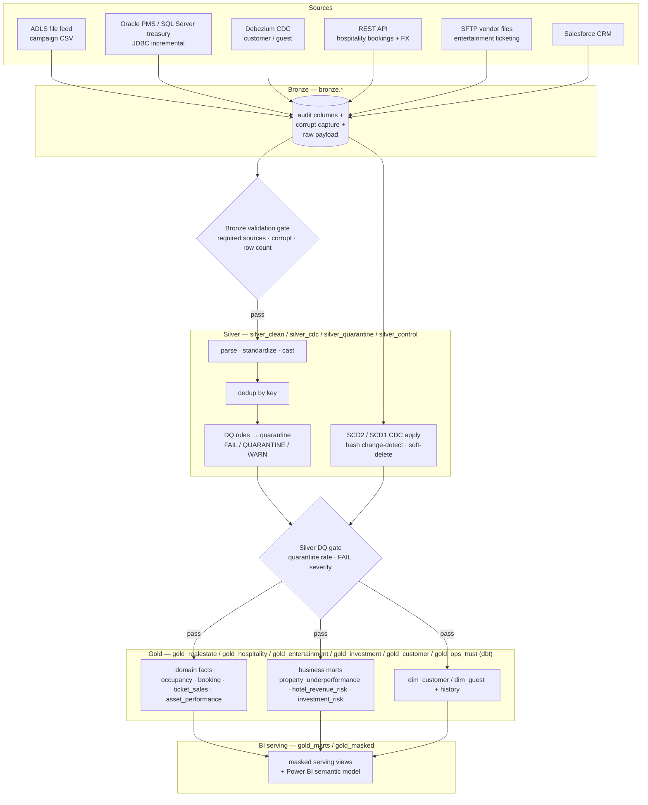
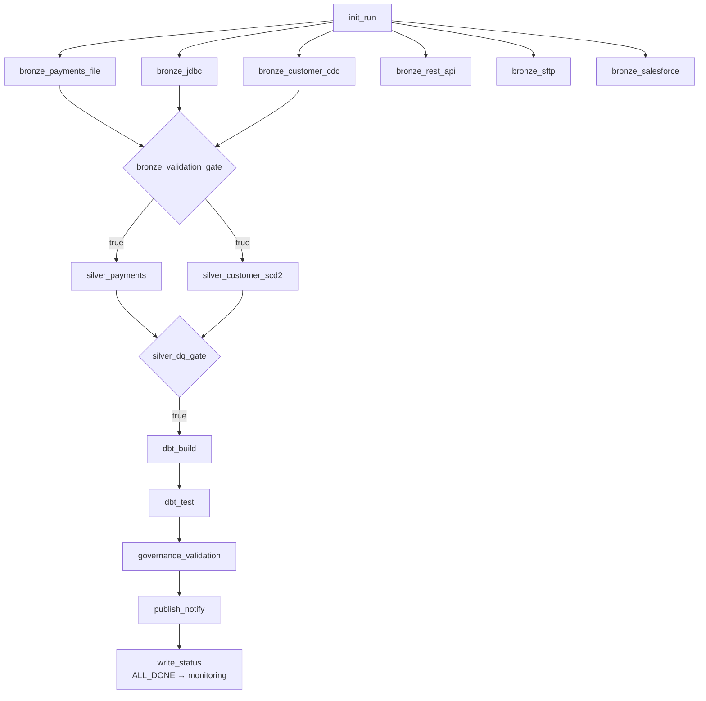
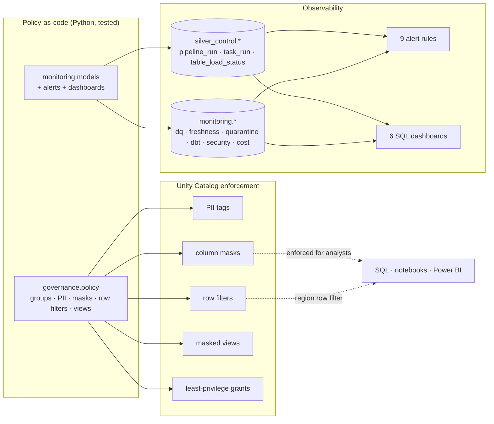
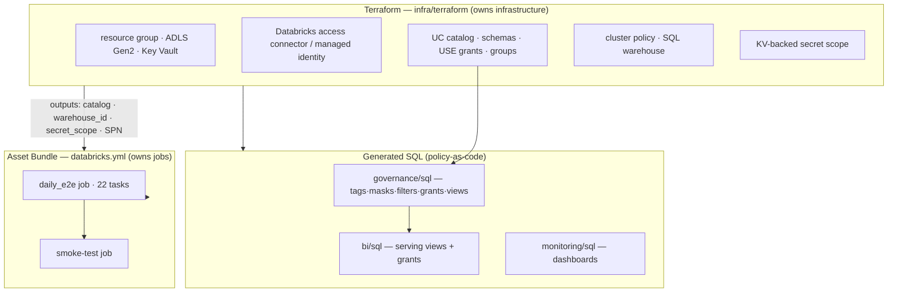
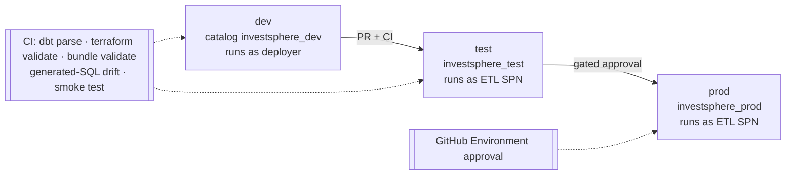

# Architecture

> This project evolved from a payments-practice foundation into an enterprise
> business AI decision platform. The original ingestion and lakehouse patterns were
> preserved and generalized across enterprise domains.

Diagrams for the InvestSphere enterprise decision platform (bundle/package name
`investsphere_payments`, an internal identifier retained from the payments-practice
foundation). Each renders on GitHub (Mermaid) and has an ASCII equivalent for
terminals. See [`DESIGN.md`](DESIGN.md) for the narrative design, the
[`ENTERPRISE_PIVOT.md`](ENTERPRISE_PIVOT.md) for the six-source → domain mapping,
and the per-area docs for detail.

- [1. End-to-end data flow (medallion)](#1-end-to-end-data-flow-medallion)
- [2. Orchestration DAG (runtime)](#2-orchestration-dag-runtime)
- [3. Governance & monitoring control plane](#3-governance--monitoring-control-plane)
- [4. Deployment topology (Terraform vs Asset Bundle)](#4-deployment-topology-terraform-vs-asset-bundle)
- [5. Environments & promotion](#5-environments--promotion)

---

## 1. End-to-end data flow (medallion)

Six sources land in Bronze; quality gates promote between layers; dbt builds Gold;
the BI layer serves Power BI. Schemas shown are the Unity Catalog schemas.



```
 file ─┐
 jdbc ─┤
 cdc  ─┼─▶ BRONZE ─▶ [bronze gate] ─▶ SILVER ─▶ [DQ gate] ─▶ GOLD (dbt) ─▶ BI serving
 rest ─┤   audit+         pass        parse/dedup    pass     dim/fact/      masked views
 sftp ─┤   corrupt                    DQ/quarantine            marts          + semantic model
 sfdc ─┘                              SCD2 CDC apply
```

A **failed optional source** (REST/SFTP/Salesforce) does **not** block the gate or
downstream — the gate depends only on the required sources unless a source is
added to its `required_sources` policy.

---

## 2. Orchestration DAG (runtime)

`investsphere_payments_daily_e2e` (internal name) — 22 tasks, mirrored 1:1 in
`databricks.yml` as a Lakeflow Job and executed locally by `orchestration/runner.py`.
Gates publish a task value that a condition task branches on; `write_status` runs
`ALL_DONE`. The `bronze_payments_file` and `silver_payments` task names are the
retained payments-practice path — the same Autoloader/Silver mechanics now carry the
enterprise campaign and domain payloads.



Parallel Bronze fan-out → validation gate → parallel Silver → DQ gate → dbt Gold →
governance validation (fails the job on any PII/access violation) → publish →
monitoring write. Details in [ORCHESTRATION.md](ORCHESTRATION.md).

---

## 3. Governance & monitoring control plane

Cross-cutting planes that wrap the data flow. Both are **policy-as-code** and
rendered to Databricks SQL / control tables.



- **Governance** (`governance/`, [GOVERNANCE.md](GOVERNANCE.md)): 5 groups, no raw
  PII for engineers/analysts, masked + region-filtered serving — generated to
  `governance/sql/`. Analysts and Power BI inherit the same enforcement.
- **Monitoring/cost** (`monitoring/` + `perf/cost.py`, [MONITORING.md](MONITORING.md),
  [PERFORMANCE_COST.md](PERFORMANCE_COST.md)): the DAG is instrumented to write
  control + monitoring rows; alerts route to email/Teams/ITSM; dashboards and cost
  attribution map to Databricks system tables in prod.

---

## 4. Deployment topology (Terraform vs Asset Bundle)

Clear ownership split — **Terraform builds the house, the Asset Bundle moves in.**



```
Terraform (infra)  ──outputs──▶  bundle_vars/<env>.yml  ──▶  Asset Bundle (jobs)
        │                                                         │
        └─▶ catalog/schemas/grants ─▶ governance SQL ─▶ BI SQL ─▶ monitoring SQL
```

Ordering: **1** Terraform `apply` → **2** generated SQL (`scripts/deploy_sql.sh`:
governance → BI → monitoring) → **3** `databricks bundle deploy` → **4** smoke-test
job. Full runbook in [DATABRICKS_DEPLOYMENT.md](DATABRICKS_DEPLOYMENT.md).

---

## 5. Environments & promotion



Three independent Terraform states + bundle targets; identical module/job graph,
per-env tfvars/bundle vars. dev runs as the deploying user; **test/prod run as the
ETL service principal** (the only writer of base tables); prod is gated behind a
manual approval. See [TERRAFORM.md](TERRAFORM.md) and
[DATABRICKS_DEPLOYMENT.md](DATABRICKS_DEPLOYMENT.md).

---

## 6. AI plane & production delivery (`ai/`)

The GenAI plane sits on the Gold marts. The agent has **two interchangeable runtimes**
(raw Azure OpenAI loop / LangGraph) behind one tool + guardrail + eval + observability
layer, plus an Azure AI Foundry twin. The model is **swappable** (default: two-tier
**GPT-4o + GPT-4o-mini** via the router — see [MODEL_SELECTION.md](MODEL_SELECTION.md)).

```
 user ─▶ APIM ─▶ Enterprise Decision Agent (Container Apps / Foundry Agent Service)
                  ├─ UC SQL tools ─▶ governed Gold marts (read-only, masked, MI/Entra-token auth)
                  ├─ Azure AI Search RAG (hybrid+semantic; EN + AR policy corpora)
                  ├─ guardrails: Content Safety (Prompt Shields · PII · jailbreak)
                  ├─ structured output: BusinessRecommendation (JSON schema)
                  └─ obs+eval: App Insights traces · MLflow/Azure evaluators · cost/pricing
   enhancements: Doc-Intelligence reconciliation · streaming HITL approval · Teams publishing
```

### Delivery pipeline (GitHub Actions — build-once / promote-by-digest, OIDC, blue-green)
```
PR      → offline AI QUALITY GATE (required): unit·chaos·red-team·Arabic·retrieval-lift·structured·authz
push    → build ONCE → digest ──┬─▶ deploy-test  (env test, cutover + smoke on real Gold)
                                 └─▶ deploy-prod  (needs deploy-test → SAME digest;
                                       env prod approval → 20% canary → soak → promote-100% | rollback-to-blue)
nightly → live-Azure gate (eval + red-team + parity) → evidence artifact + Teams alert on fail
auth    → Azure OIDC (no SP secret) · least-privilege custom deploy role · Databricks via managed-identity Entra token
```
Details: [CICD_SETUP.md](CICD_SETUP.md) · [EVALUATION_OBSERVABILITY.md](EVALUATION_OBSERVABILITY.md) ·
[ai/README_ENHANCEMENTS.md](../ai/README_ENHANCEMENTS.md).
