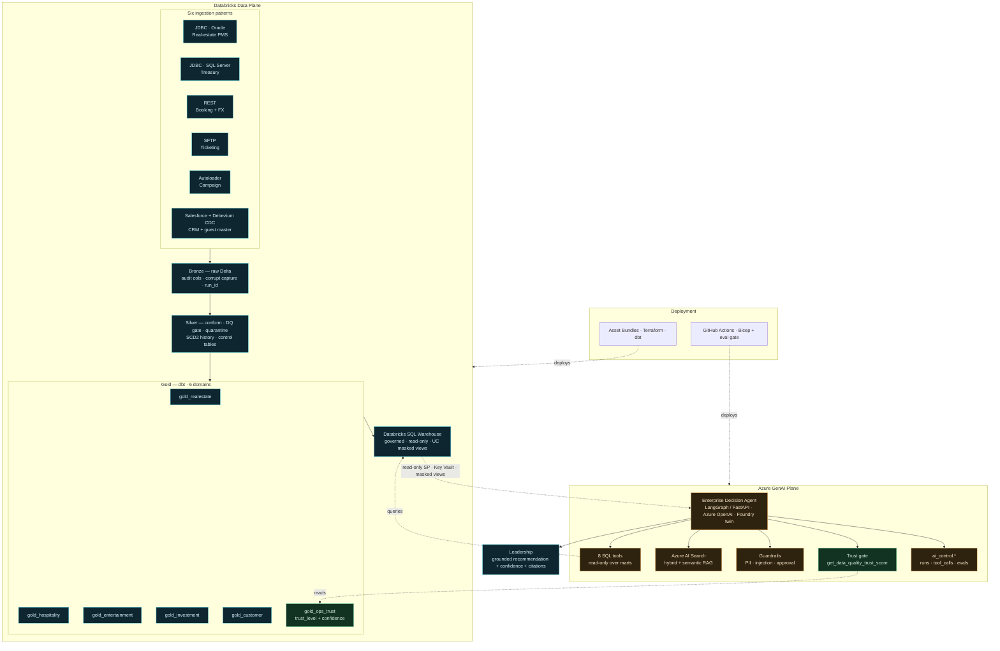
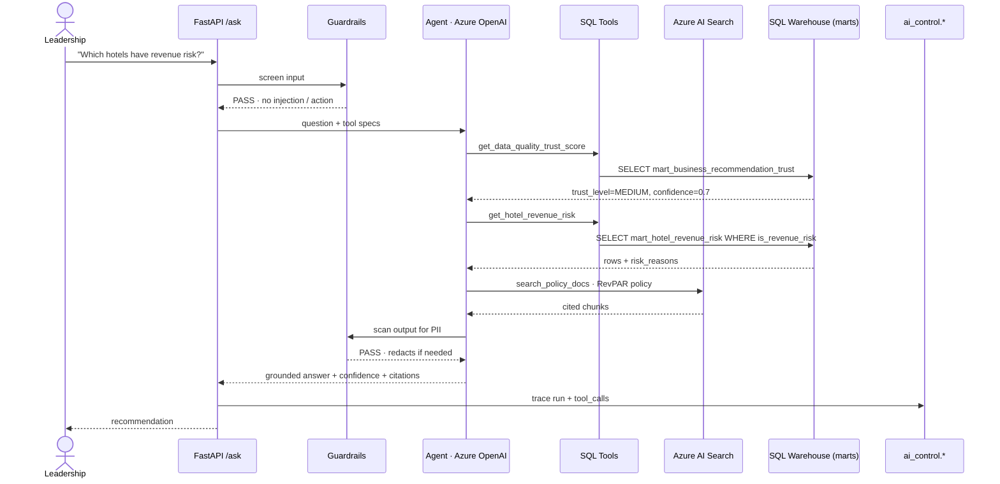
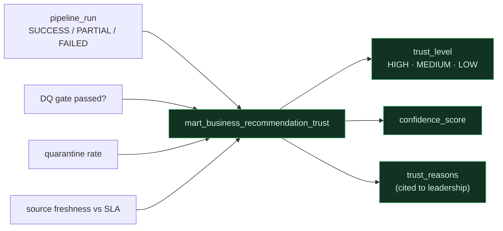

# InvestSphere — Enterprise Architecture (diagrams)

Diagrammatic view of the diversified-enterprise lakehouse + Azure AI decision agent.
Renders on GitHub / any Mermaid viewer. See `docs/ENTERPRISE_PIVOT.md` for the design
contract and `docs/GENAI_INTERVIEW_STORY.md` for the narrative.

## 1. System architecture — two planes

Data plane (Databricks) produces governed marts; the GenAI plane (Azure) queries them
through a read-only, PII-masked boundary and never runs the pipeline.

## 2. Live query — one question, end to end

## 3. Data-quality trust roll-up (`gold_ops_trust`)

