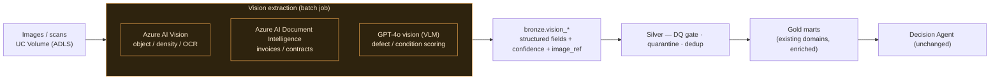

# Multimodal / Computer Vision — Future Extension

An **optional** architecture for adding Computer Vision / Vision-Language Model (VLM) signals to
the InvestSphere platform. The diversified-enterprise domains generate a lot of imagery and
scanned documents that today never reach the lakehouse — vision could turn them into structured
signals that feed the **existing** Gold marts and the decision agent.

> **Status: architecture only.** No image or document pipelines are implemented. This documents
> *how* vision would plug into the current design without disrupting it — nothing here is built.

## 1. Why it fits this platform

The current agent answers from **structured** marts. A large amount of ground-truth about the same
assets lives in **unstructured images/scans** that could corroborate or lead the structured signal:

| Domain | Vision use case | Feeds / corroborates |
|---|---|---|
| Real estate | **Property inspection images** — facade, common areas, defects | `mart_property_underperformance` (condition ↔ maintenance cost / occupancy) |
| Hospitality | **Maintenance & room-condition images**, guest-submitted photos | `fact_maintenance`, guest sentiment, revenue-risk drivers |
| Entertainment | **Venue crowd images** — density / queue length | `fact_footfall`, `mart_venue_conversion_risk` (crowd ↔ conversion) |
| Investment / Finance | **Invoice & document screenshots**, statements, contracts | `fact_cashflow`, cost lines, lease terms (via document extraction) |

The value: vision-derived fields become **just another Bronze source** flowing through the same
Silver DQ/quarantine/SCD2 and into the same marts — so the agent can answer *"which property is
underperforming AND shows visible defects?"* without any change to its reasoning pattern.

## 2. Two integration patterns (both optional)

### Pattern A — Batch enrichment into the lakehouse (offline, preferred)
Images/scans land in an ADLS / Unity Catalog **Volume**; a scheduled job runs a vision model to
extract **structured fields**, which are written to Bronze and conformed like any other source.

- **Output is structured, not pixels**: e.g. `{property_id, defect_score, defect_labels[],
  image_ref, model, confidence, captured_at}`. Marts never store images — only derived signals.
- Reuses the **entire** DQ / quarantine / control / governance machinery. Vision confidence below
  a threshold → quarantine, exactly like a bad row today.

### Pattern B — On-demand VLM tool for the agent (interactive)
Add a governed tool, e.g. `analyze_inspection_image(image_ref)`, that the agent may call when a
user attaches or references an image. Returns a structured description + score the agent folds into
its answer (with the same guardrails + trust caveats). Read-only; images resolved by reference, not
uploaded into the prompt raw.

## 3. Azure building blocks (candidate services)
- **Azure AI Vision** — image analysis, object/dense-region detection, OCR (crowd density, defects).
- **Azure AI Document Intelligence** — invoices, receipts, contracts → key-value + tables
  (feeds cashflow/cost lines).
- **GPT-4o / vision-capable Azure OpenAI models** — open-ended VLM scoring ("rate visible
  condition 1–5 with reasons") when detection classes aren't fixed.
- **Databricks** — batch orchestration, Volumes for image storage, Delta for extracted fields.

## 4. Governance & guardrails extension (required before any build)
Vision adds **new privacy surface** that the existing guardrails don't yet cover:

- **Faces / people** in crowd and inspection images → detect and **blur/redact** before storage or
  model calls; store only aggregate density, never identities.
- **PII in documents** (names, account numbers on invoices/contracts) → Document Intelligence output
  passes through the **same PII masking** as structured PII; raw scans locked to stewards.
- **Image provenance & retention** — `image_ref` + capture metadata logged; retention policy;
  images never enter the agent's prompt or `ai_control` traces as raw pixels.
- **Eval extension** — add vision-grounding eval cases (does the extracted field match the image?)
  to the gate before any vision tool ships.

## 5. Explicitly out of scope now
Not implemented: image ingestion, any vision model call, `bronze.vision_*` tables, the VLM tool,
face redaction, or document extraction. This document exists so the extension is **designed and
governance-aware** if a future phase needs it — the current production design stays focused on
structured data + RAG + tool calling.

## 6. Summary
Vision is a **clean additive extension**: derived fields enter as a normal Bronze source and flow
through the unchanged medallion + agent, or as an optional governed VLM tool. It is **documented,
not built** — and would only proceed after the privacy/redaction guardrails above are in place.
