# Multi-Agent Extension — future scope (documentation only)

How the single Enterprise Decision Agent *could* split into a small, governed multi-agent system.

> **Status: documentation only.** No multi-agent code is implemented. The current design is
> intentionally **single-agent** for simplicity, reliability, and production control.

## 1. What exists today
One governed **Enterprise Decision Agent** answers everything — business-risk questions
("which hotels have revenue risk?") and operational-trust questions ("why did the pipeline go
PARTIAL?", "can we trust today's numbers?") — through one tool surface, with guardrails, a trust
gate, and observability. It works because the tool layer is already cleanly separated (see §3).

## 2. The future split (three roles)

```mermaid
flowchart TB
  U["User question"] --> R["Router Agent"]
  R -->|business risk / recommendation| D["Decision Agent"]
  R -->|pipeline / DQ / trust| O["DataOps Agent"]
  R -->|both| D & O
  D --> SYN["Synthesized, trust-caveated answer"]
  O --> SYN
  classDef ai fill:#2e230e,stroke:#f0a850,color:#fbe9cf;
  class R,D,O ai;
```

- **Decision Agent** — business risk + leadership recommendations. Uses the domain marts
  (`get_underperforming_properties`, `get_hotel_revenue_risk`, … `get_top_business_actions`) + RAG
  over policies.
- **DataOps Agent** — explains pipeline status, DQ failures, quarantine, source freshness, and
  PARTIAL runs. Uses the ops/trust tools (`get_pipeline_status`, `get_data_quality_trust_score`)
  over `gold_ops_trust` + the control tables.
- **Router Agent** — classifies the user's question and routes to the Decision Agent, the DataOps
  Agent, or both, then synthesizes (a business answer *with* its data-trust caveat).

## 3. Why the current tool layer already supports it
The split is low-cost because responsibilities are **already separated at the tool boundary**:
- **Business tools** (domain marts) → naturally the Decision Agent's surface.
- **Ops/trust tools** (`gold_ops_trust`, control tables) → naturally the DataOps Agent's surface.

A future build would give each agent a **subset** of the existing `TOOL_DISPATCH` — no new tools,
no new data access, no logic rewrite. The router is a thin classifier over the two toolsets.

## 4. Design constraints that must carry over
- **Bounded, human-in-the-loop.** Every agent recommends; none executes business changes without
  approval (write/action tools stay approval-gated, as today).
- **Trust stays central.** A Decision answer must still be paired with the DataOps trust signal —
  the router synthesizes, it doesn't drop the caveat.
- **Same guardrails + evals + observability.** Each agent + the router go through the same PII/
  injection guardrails, eval gate, and `ai_control.*` tracing before shipping.

## 5. Why it's not built now (and that's the right call)
A single agent is **easier to evaluate, cheaper, more predictable, and easier to govern** — fewer
moving parts, one place for guardrails and trust logic, no inter-agent failure modes. Multi-agent
is only worth it when the tool surface or question space grows enough that one agent's routing
degrades. Until then, the single Decision Agent is the production choice; this split is **optional
future scope**, kept ready by the clean tool separation above.
